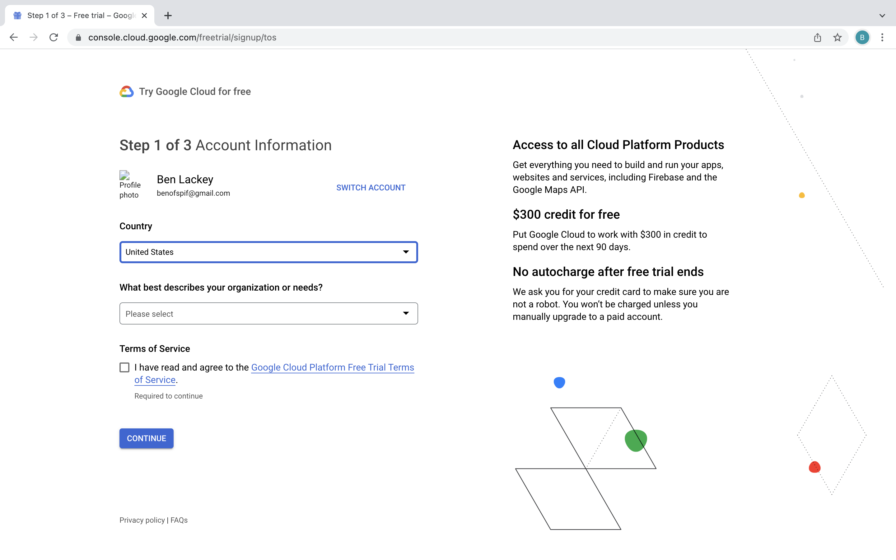
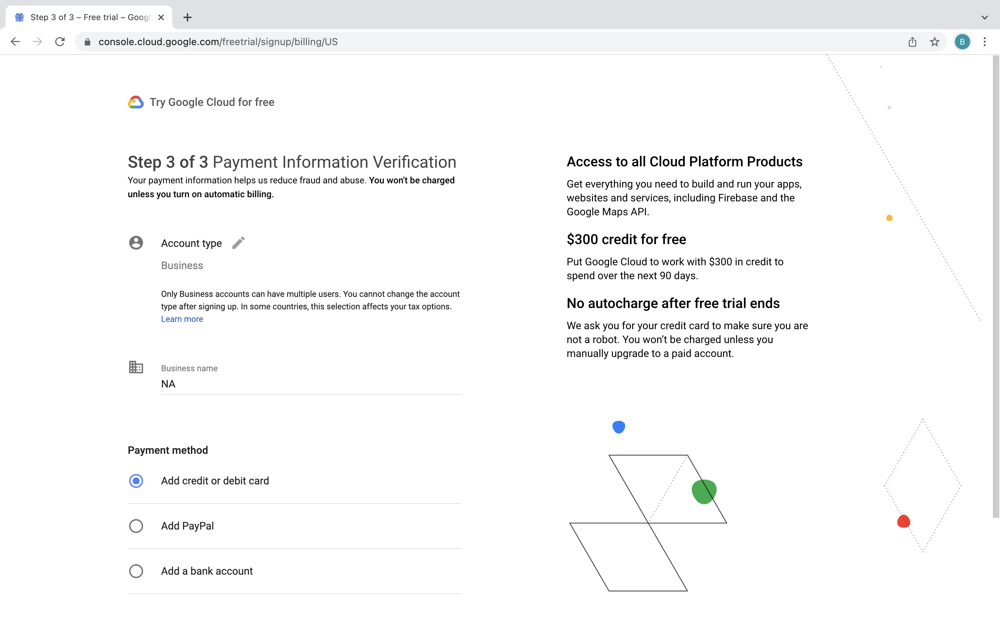
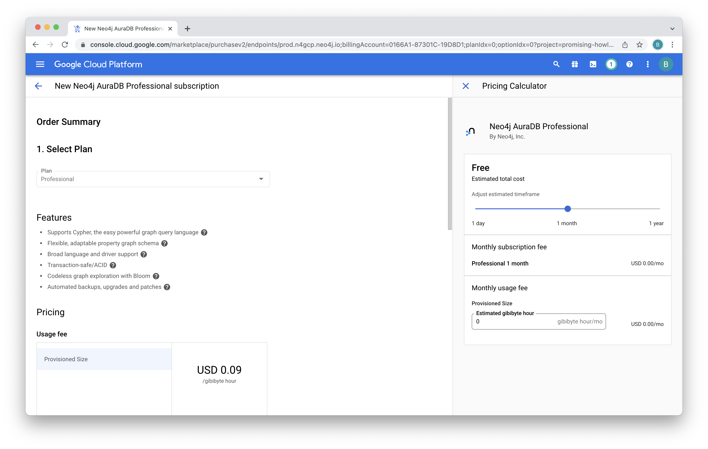
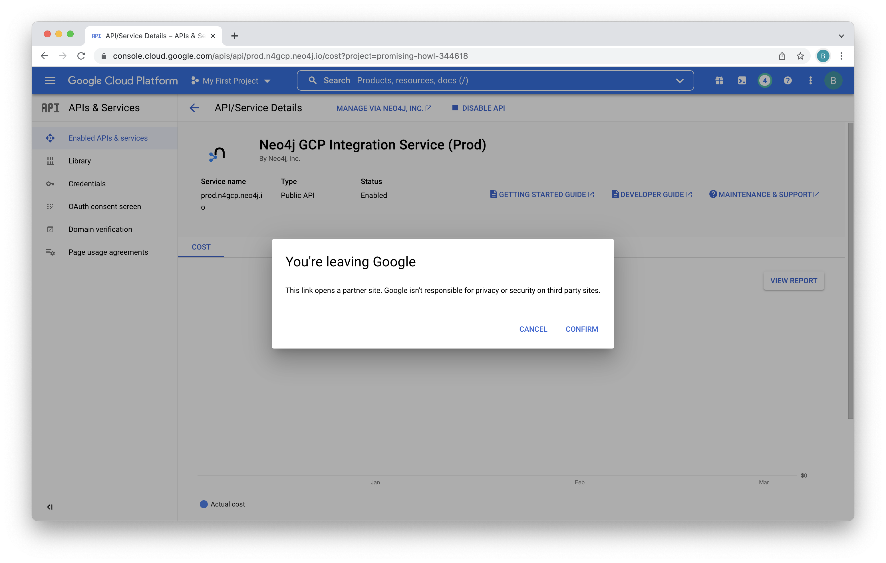
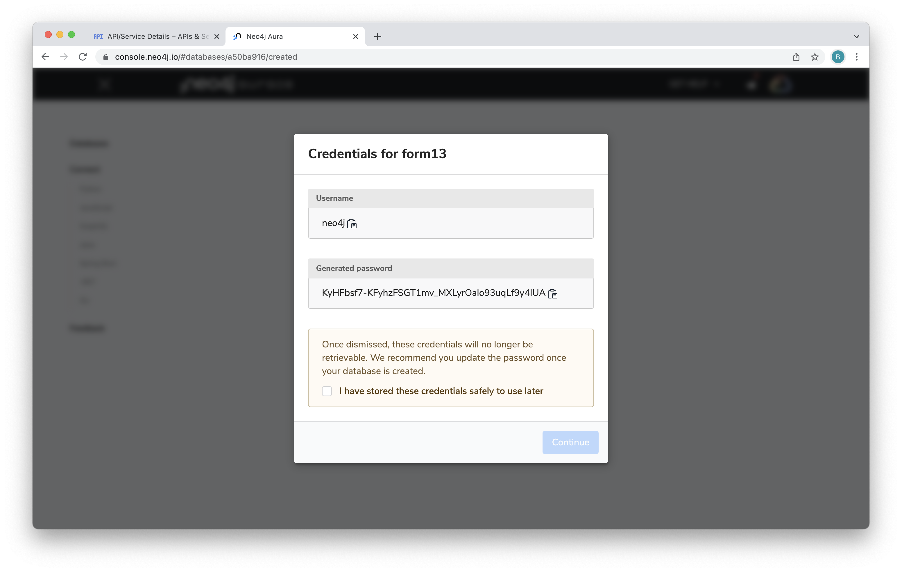
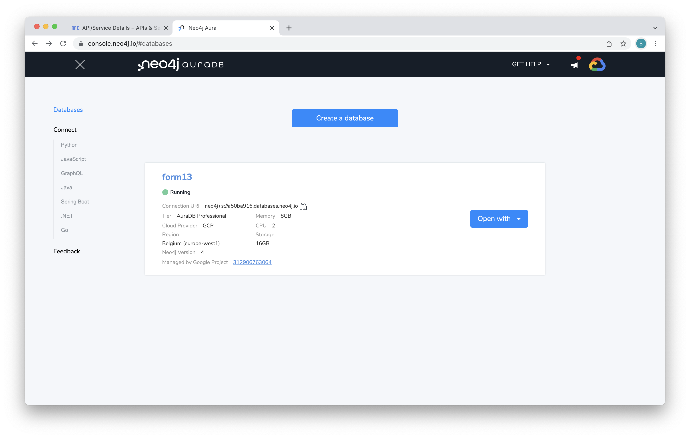
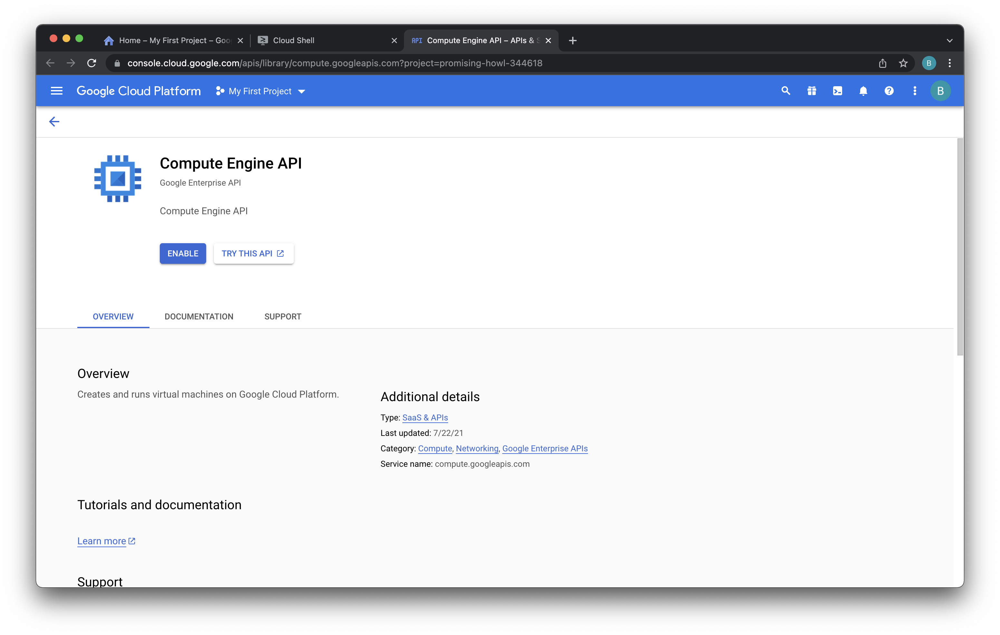

# Lab 1 - Deploy Neo4j
In this lab, we're going to deploy Neo4j from the Google Cloud Marketplace.  We'll deploy two different ways.  The first is our Software as a Service (SaaS) or Database as a Service (DBaaS) offering, Neo4j AuraDB.  The second is a Neo4j IaaS listing.  That listing has a Deployment Manager template under it that we'll inspect.  We'll also look at more customizable deployment options.

## Sign up for GCP
The most basic thing you're going to need for these labs is a Google Cloud Platform (GCP) account.  If you already have a personal account or one through your company, you can use that.  If you don't have an account yet, you can sign up for one [here](https://console.cloud.google.com/).  That may require you to sign up for a Google account as well if you don't already have one.

You'll need to provide your phone number and credit card information.  New GCP accounts come with a $300 credit. Total costs for the lab should be significantly under $50. At the end of the lab we'll show you how to delete any resources you've deployed as well.

Once you've signed up for an account, you'll see a dialog to activate your $300 in credits.  Click activate.

Accept the terms of service and click "Continue."

Verify your phone number and click "Continue."

Provide your payment information and click "Continue."  Note this is only used to verfiy your identity.  It will not be charged unless both your $300 credit is exhausted and you enable billing.

You'll now be presented with the console again.  There may be a few help dialogs you can dismiss.

Great!  You now have a GCP account and you're all ready to get started deploying stuff!

## Deploying Neo4j AuraDB through the Marketplace
Now let's deploy Neo4j's managed service, AuraDS.  We're going to deploy the professional version.  To do that, first navigate to the console [here](https://console.cloud.google.com/).  Then click the hamburger icon in the upper left to exapnd the menu.

In that left menu, scroll down to the bottom.

You'll see a listing for Neo4j.  Click on that.

That takes you to a description of Neo4j AuraDB Professional.  Click on "Subscribe."

On the plan summary, review it and then scroll to the bottom.

Review the terms and accept them.  Then click "Subscribe."

You'll see a message that "Your order is now active."  Click "Go to product page."

We're now subscribed but need to enable the API.  Click on "Enable."

When complete you'll see this page.  Click on "Manage Via Neo4j, Inc." at the top of the page.

Confirm that you're ok with getting redirected to the management console.

You'll be asked which Google credentials you want to use.  Be sure to select the same credentials you've been using so far.

You'll need to agree to some terms and cookies.  Click "Got it" and "I agree."

And, now you're at the AuraDB console.  At this point, we've authorized the API and logged into the console for AuraDB Professional.  We can now create our first database.  Click on "Create a database."

We're presented with various options for that database.  We can accept the defaults here.  Scroll to the bottom.

For database name, enter "form13."  Click "I understand."  Then click "Create Database."

You'll be presented with the credentials for your database.  Be absolutely certain to write those down.  We can't get them again later and you'll need them in a later lab.  Once you've done that click "I have stored these credentials safely to use later." Then click "Continue."

You'll see a dialog that your database is being created.  This takes less than five minutes.

When deployment is complete you'll see this menu.

You can poke around the menus here a bit and see more on database status and connection information.

## Deploying Neo4j Enterprise Edition on IaaS
Now we're going to deploy Neo4j a second way, on Infrastructure as a Service (IaaS).  We'll be using Neo4j Enterprise Edition.  That is the installable version of Neo4j.  The Marketplace listing has a Deployment Manager (DM) template that deploys Neo4j for you.  This has options to deploy Neo4j Graph Database, Neo4j Graph Data Science and Neo4j Bloom.  We're going to use the IaaS version for our exercises because it has all these additional features.

* Graph Database is, as the name implies, Neo4j's core database.  It's designed from the ground up to store graphs.  This comes in both a community and an enterprise version.  We're going to use the enterprise version.
* Graph Data Science (GDS) is the graph library that installs on top of the database.  It has implentations of 60 different graph algorithms.  We're going to use GDS to do things like create graph embeddings later in the labs.
* Bloom is a business intelligence tool.  We'll install it as well and use it to explore the data.

We're going to be using the absolute cutting edge, a new template that isn't available in the Marketplace yet.  The Marketplace is essentially a nice GUI around Deployment Manager.  So, what we're going to do is a little more raw and technical.

So, let's get started deploying...  To do so, let's go to the Google Cloud console [here](https://console.cloud.google.com/).  

We're going to use Cloud Shell as our CLI.  This is a CLI built into the console.  It's really nice because it's kept up to date automatically and your credentials are alreayd in it.  Click on the "Activate Cloud Shell" icon in the upper right of the console.

If you're running cloud shell for the first time, you'll be presented with a dialog like this.  Just click "Continue."

Cloud Shell takes a few seconds to spin up.  When it's ready you'll see a terminal like this.  Click the "open in new window" button on the upper right of the Cloud Shell to expand it.

Now we have a nice full screen shell.  

Neo4j hosts our partner work in the Neo4j Partners GitHub org [here](https://github.com/neo4j-partners).  We're going to use the Deployment Manager repo [here](https://github.com/neo4j-partners/google-deployment-manager-neo4j).  To clone a copy to our Cloud Shell machine, run this command:

    git clone https://github.com/neo4j-partners/google-deployment-manager-neo4j.git

That should give you something like this:

Run a few more commands...

    clear
    ls
    cd cd google-deployment-manager-neo4j
    ls

We're now in the repo we cloned.  It has a README that describes the repo.  That's probably better view in a web browser [here](https://github.com/neo4j-partners/google-deployment-manager-neo4j) though.  The LICENSE file states this is Apache 2.0 licensed, so you're free to fork it and modify it to your heart's content.

Then there's a directory for Marketplace.  That's some GUI wrapper stuff written in jinja plus some helper scripts for packaging in marketplace.  That brings us to the simple directory.  Simple is the basic DM template.  Let's cd in there and list the contents.

    clear
    cd simple
    ls

deployment.py and cluster.py are Google Deployment Manager (DM) files.  This is Google Infrastructure as Code (IaC) language that automates deploying resources on Google Cloud Platform (GCP).  node.sh is a script that runs automatically in the DM template.

We're going to run the deploy.sh script.  That calls DM.  It takes two parameters, the name of a deployment and the name of a config file.  We're going to use the single parameters file, parameters.single.yaml.  This deploys a single node of Neo4j. 

Before we run it, we need to make one change.  We're going to be using two products that require license keys, Neo4j Bloom and Neo4j Graph Data Science.  You're going to need to open parameters.single.yaml in your favorite text editor, say vi.  Then you'll need to update the values of graphDataScienceLicenseKey and bloomLicenseKey to the keys provided by the person running this lab.

** IMPORTANT - Note that if you skip the license key step, Bloom will not run and Neo4j Graph Data Science will run in community mode which limits its functionality. This will limit your ability to complete later exercises. **

Let's run it and deploy Neo4j!

    clear
    ./deploy.sh neo4j single

If you've never run DM before, you may get a few messages asking you to authorize it.  Click "AUTHORIZE" and type "y."

On a brand new account, you may see other errors if services are not authoized.  In this case both the Compute Engine wasn't yet authorized.  Click on the link in the terminal output to go to the service and authorize it.

For compute, it looks like this.  Click "enable."

When the compute API is finished enabling, you will see this message.

Now, back in the terminal, let's try running the deploy again.  We're going to need to delete the earlier deployment first.

    clear
    gcloud deployment-manager deployments delete neo4j

When prompted if you want to delete the deployment, type "y."

Now let's run the deploy again.

    clear
    ./deploy.sh neo4j single

The deployment takes a few minutes to run.  When complete, you'll see this:

You now have a single node of Neo4j running!  In the next lab, we'll connect to it.