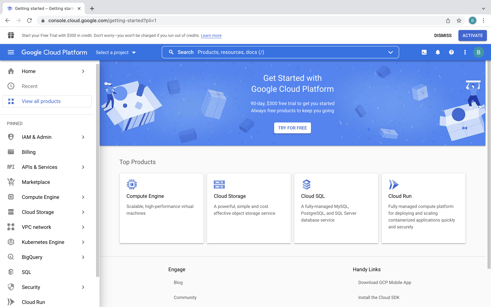
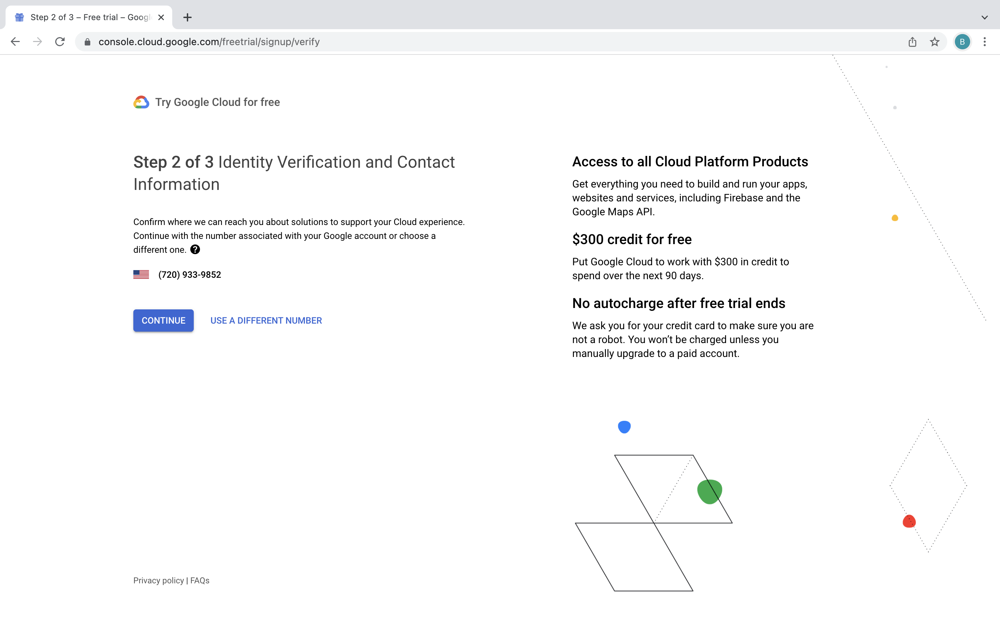
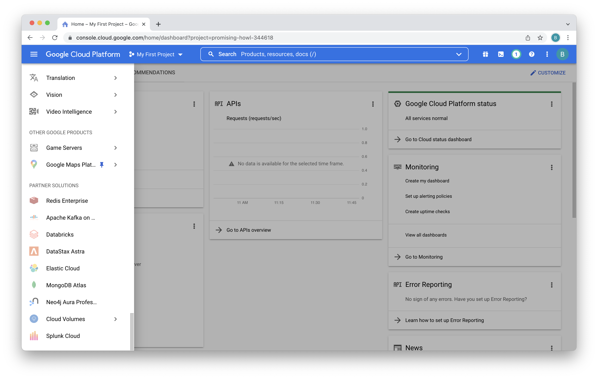
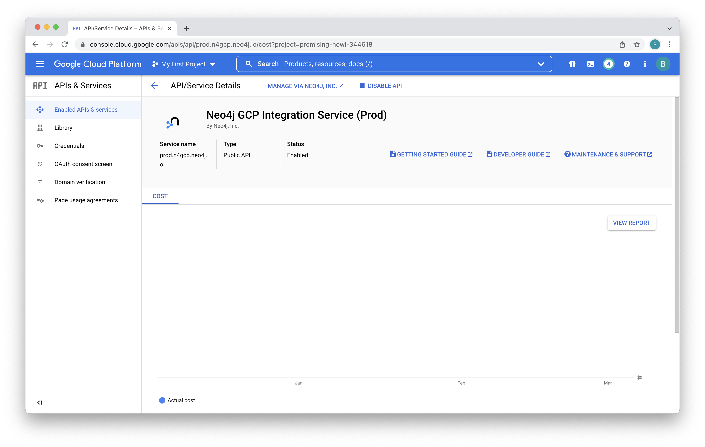
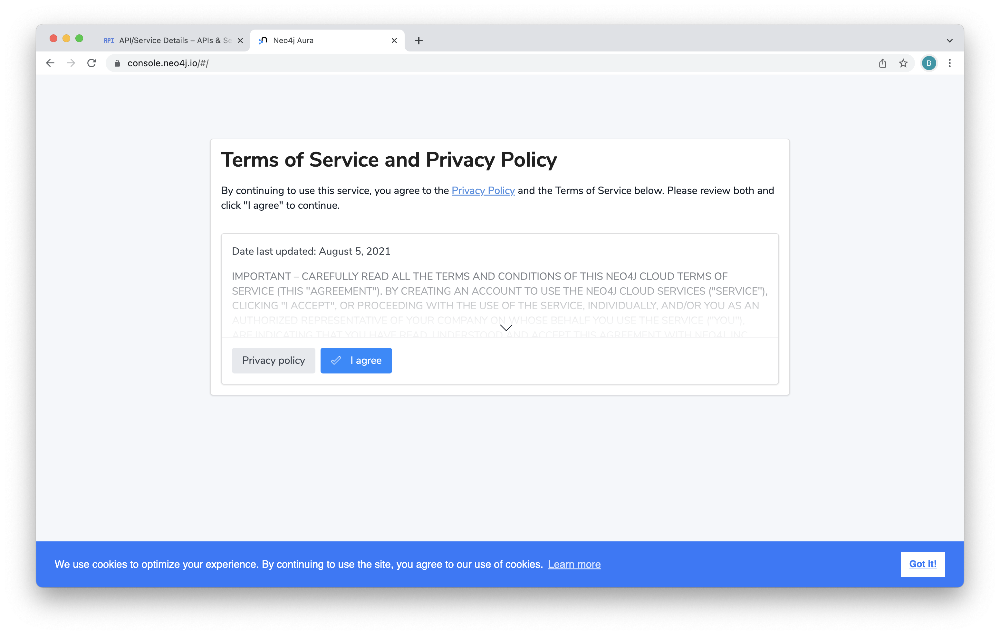
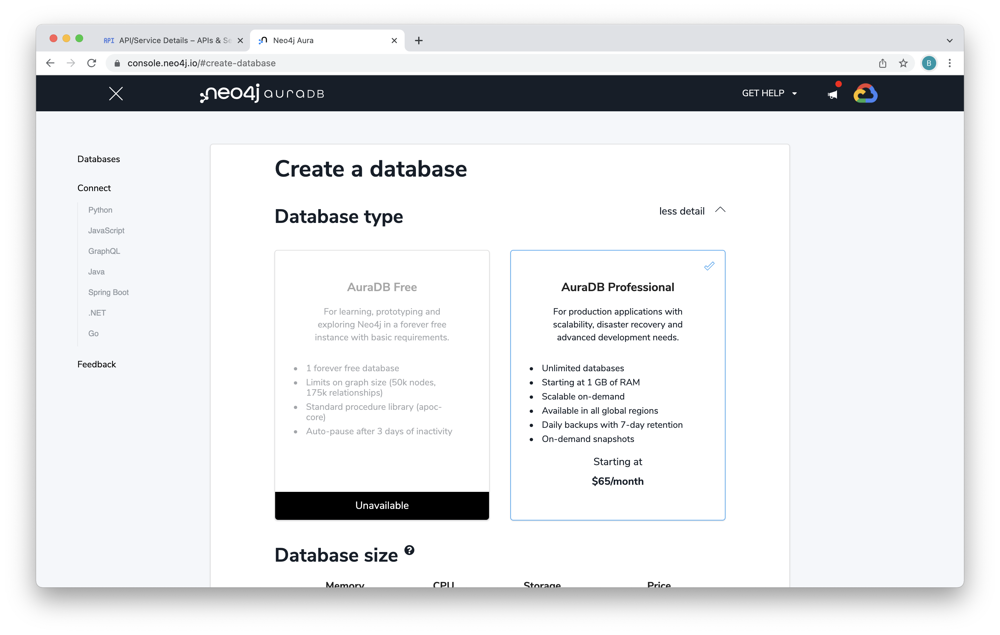
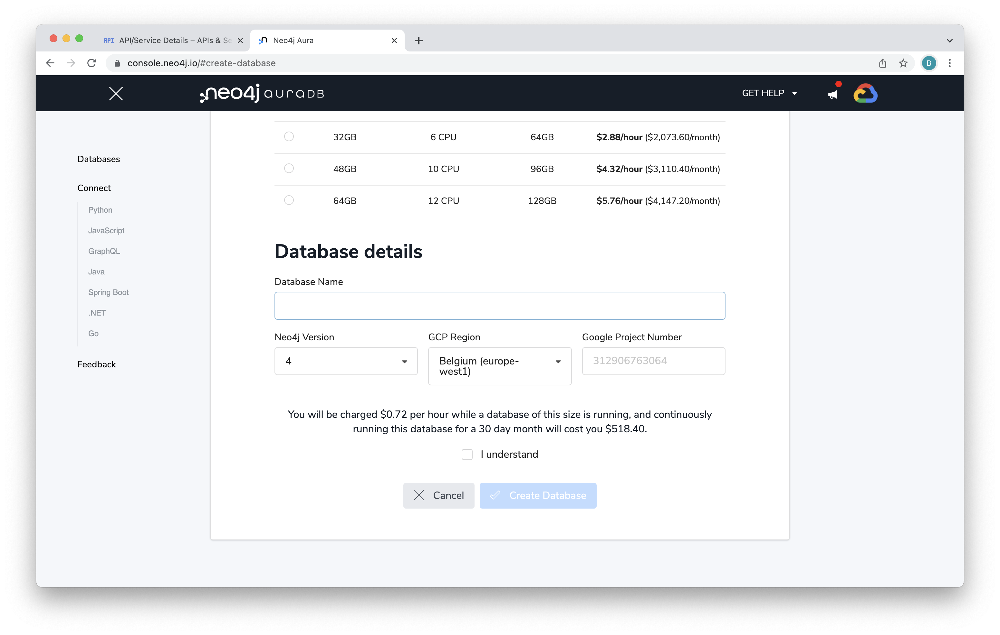

# Lab 1 - Deploy Neo4j
In this lab, we're going to deploy Neo4j from the Google Cloud Marketplace.  We'll deploy two different ways.  The first is our Software as a Service (SaaS) or Database as a Service (DBaaS) offering, Neo4j AuraDB.  The second is a Neo4j IaaS listing.  That listing has a Deployment Manager template under it that we'll inspect.  We'll also look at more customizable deployment options.

## Sign up for GCP
The most basic thing you're going to need for these labs is a Google Cloud Platform (GCP) account.  If you already have a personal account or one through your company, you can use that.  If you don't have an account yet, you can sign up for one [here](https://console.cloud.google.com/).  That may require you to sign up for a Google account as well if you don't already have one.

You'll need to provide your phone number and credit card information.  New GCP accounts come with a $300 credit. Total costs for the lab should be significantly under $50. At the end of the lab we'll show you how to delete any resources you've deployed as well.

Once you've signed up for an account, you'll see a dialog to activate your $300 in credits.  Click activate.

Accept the terms of service and click "Continue."

Verify your phone number and click "Continue."

Provide your payment information and click "Continue."  Note this is only used to verfiy your identity.  It will not be charged unless both your $300 credit is exhausted and you enable billing.

You'll now be presented with the console again.  There may be a few help dialogs you can dismiss.

Great!  You now have a GCP account and you're all ready to get started deploying stuff!

## Deploying Neo4j AuraDB through the Marketplace
Now let's deploy Neo4j's managed service, AuraDS.  We're going to deploy the professional version.  To do that, first navigate to the console [here](https://console.cloud.google.com/).  Then click the hamburger icon in the upper left to exapnd the menu.

In that left menu, scroll down to the bottom.

You'll see a listing for Neo4j.  Click on that.

That takes you to a description of Neo4j AuraDB Professional.  Click on "Subscribe."

On the plan summary, review it and then scroll to the bottom.

Review the terms and accept them.  Then click "Subscribe."

You'll see a message that "Your order is now active."  Click "Go to product page."

We're now subscribed but need to enable the API.  Click on "Enable."

When complete you'll see this page.  Click on "Manage Via Neo4j, Inc." at the top of the page.

Confirm that you're ok with getting redirected to the management console.

You'll be asked which Google credentials you want to use.  Be sure to select the same credentials you've been using so far.

You'll need to agree to some terms and cookies.  Click "Got it" and "I agree."

And, now you're at the AuraDB console.  At this point, we've authorized the API and logged into the console for AuraDB Professional.  We can now create our first database.  Click on "Create a database."

We're presented with various options for that database.  We can accept the defaults here.  Scroll to the bottom.

For database name, enter "form13."  Click "I understand."  Then click "Create Database."

You'll be presented with the credentials for your database.  Be absolutely certain to write those down.  We can't get them again later and you'll need them in a later lab.  Once you've done that click "I have stored these credentials safely to use later." Then click "Continue."

You'll see a dialog that your database is being created.  This takes less than five minutes.

When deployment is complete you'll see this menu.

You can poke around the menus here a bit and see more on database status and connection information.  We'll look at these menus in more detail later.

## Deploying Neo4j Enterprise Edition through the Marketplace
Now we're going to deploy Neo4j a second way.  To do so, let's go to the Google Cloud Marketplace.  We could go to the Marketplace and search.  But, instead, let's go directly to the listing for Neo4j Enterprise Edition.  That's [here](todo).

We'll be using Neo4j Enterprise Edition.  That is the installable version of Neo4j.  The Marketplace listing has a Deployment Manager (DM) template that deploys Neo4j for you.  This has options to deploy Neo4j Graph Database, Neo4j Graph Data Science and Neo4j Bloom.

Graph Database is, as the name implies, Neo4j's core database.  It's designed from the ground up to store graphs.  This comes in both a community and an enterprise version.  We're going to use the enterprise version.

Graph Data Science (GDS) is the graph library that installs on top of the database.  It has implentations of 60 different graph algorithms.  We're going to use GDS to do things like create graph embeddings later in the labs.

Bloom is a business intelligence tool.  We'll install it as well and use it to explore the data.

So, let's get started deploying...  Click on "Neo4j Enterprise Edition."

## Deployment Manager Template
In this lab we worked through deploying via the Marketplace.  The Marketplace is essentially a nice GUI around Deployment Manager.  If you're a more technical user and like deploying from the command line there are a variety of options.  These options are also useful if you'd like to modify the Deployment Manager template.

The place to start is the Neo4j Partners GitHub organziation.  That has a repo with the template from Marketplace as well as additional templates in it.  You can view that [here](https://github.com/neo4j-partners/google-deployment-manager-neo4j).
