# Vertex AI Workbench

## Pandas
First off, let's fiddle with the data in pandas.  We're going to use Google Colab to do that.  Colab is a really light weight way to run a notebook on Google Cloud.  Click [here](exploring_pandas.ipynb) to get started.

## Vertex AI Workbench
Now that we've done some very light weight exploration, let's try using a more full featured environment, Vertex AI Workbench.  Open up the [Google Cloud Console](https://console.cloud.google.com/).

Type Vertex AI in the search bar.

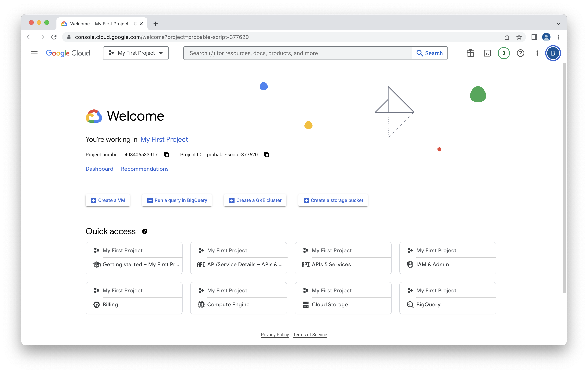

Click on the first result.

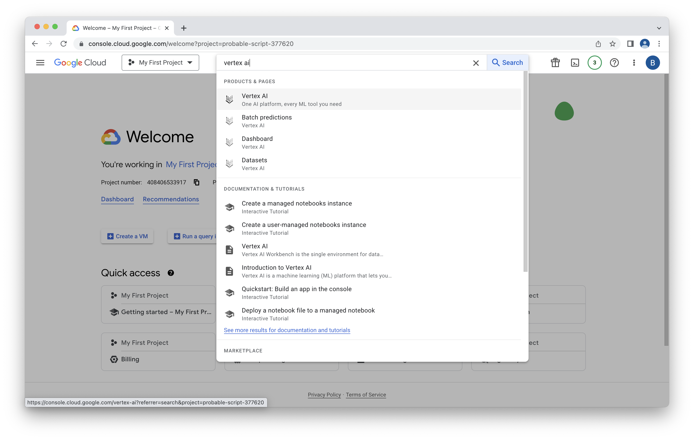

Dismiss the tutorials dialog.  Click "ENABLE ALL RECOMENDED API."

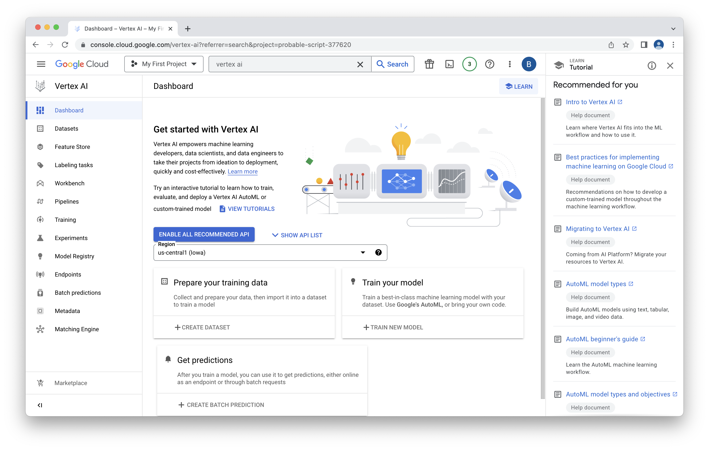

That will take a few minutes to run.  You can click on the alert icon in the upper right to view progress.

When complete, click on the Workbench link on the left hand side.

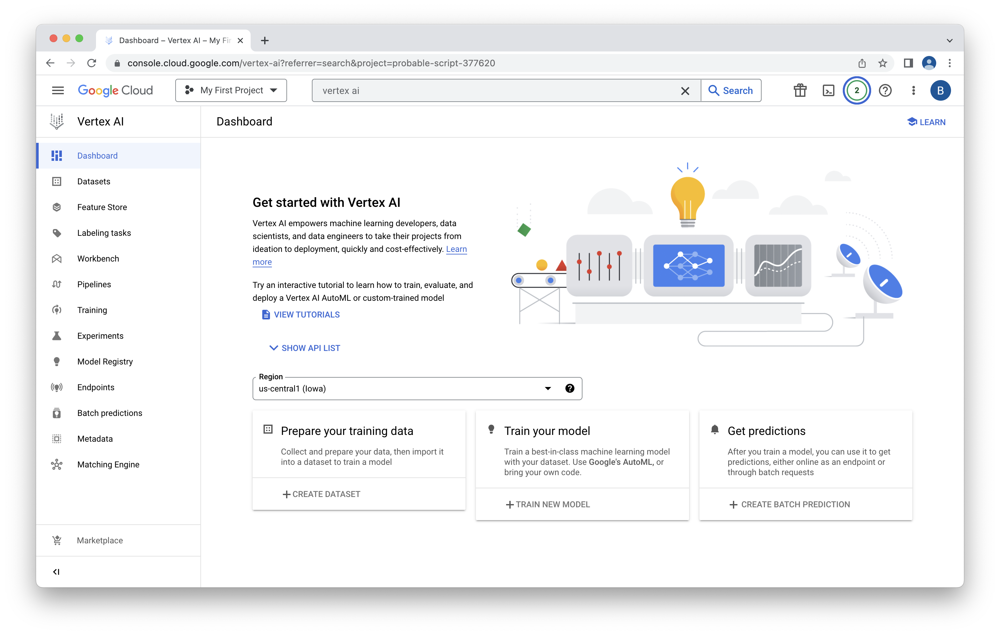

Workbench is a hosted notebook environment.  Unlike Colab, it's tightly intergrated into Vertex AI.  That means auth is easier and more libraries are installed by default.  Notebooks also keep running if you close you web browser, which is really helpful for long running jobs like AutoML training.  Of course, you need to pay for these hosted environments, whereas a base Colab environment is free.

Since we're testing out all the most advanced Google features, we want to use the fully managed notebooks, note the user managed ones.  Click on "Managed Notebook."

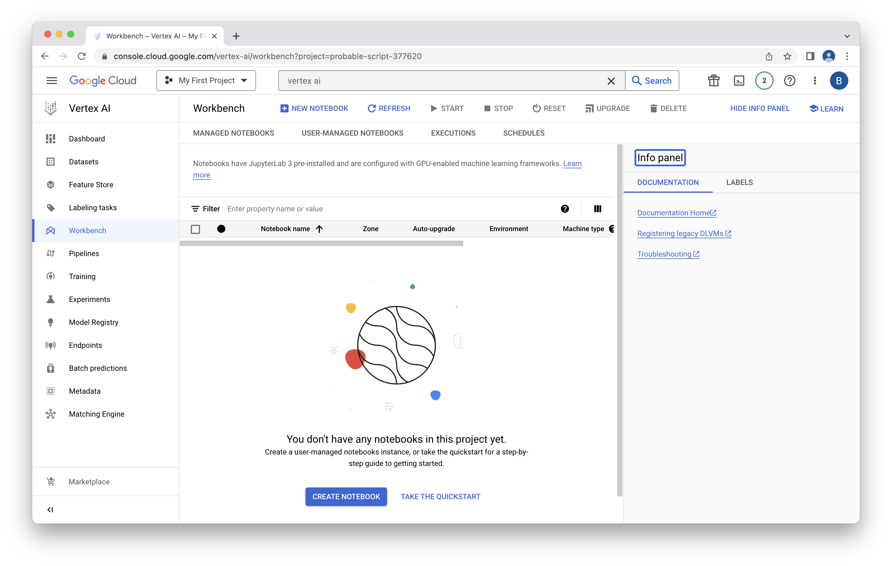

Click "CREATE NOTEBOOK."

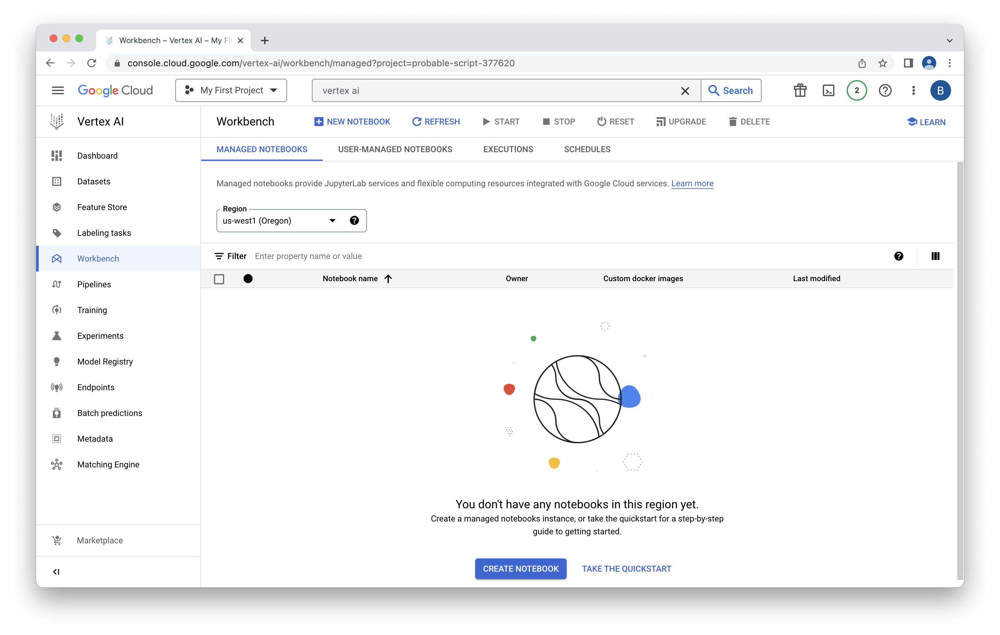

Make a note of the region your notebook is in.  You'll want to create a bucket in that same region later.  Vertex requires locality for the buckets it uses to load and write data.

Keep the defaults and select "CREATE."

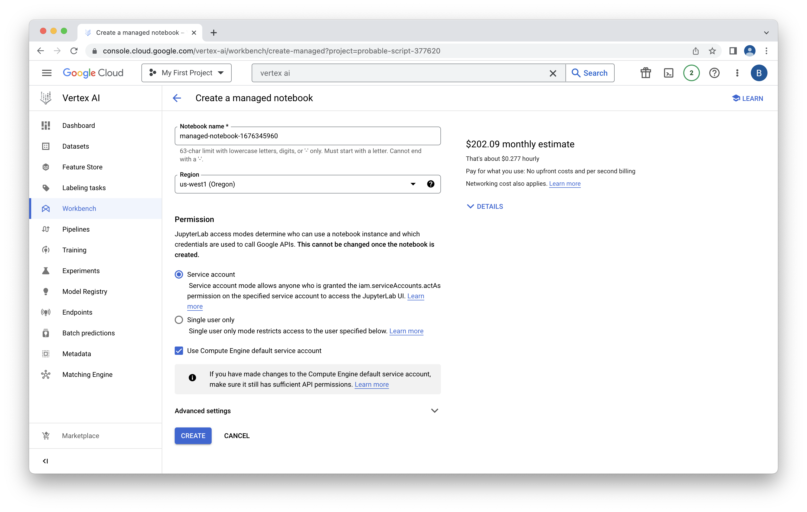

The notebook creation will take a few minutes to run.  When complete, click "OPEN JUPYTERLAB" to open the Workbench environment.

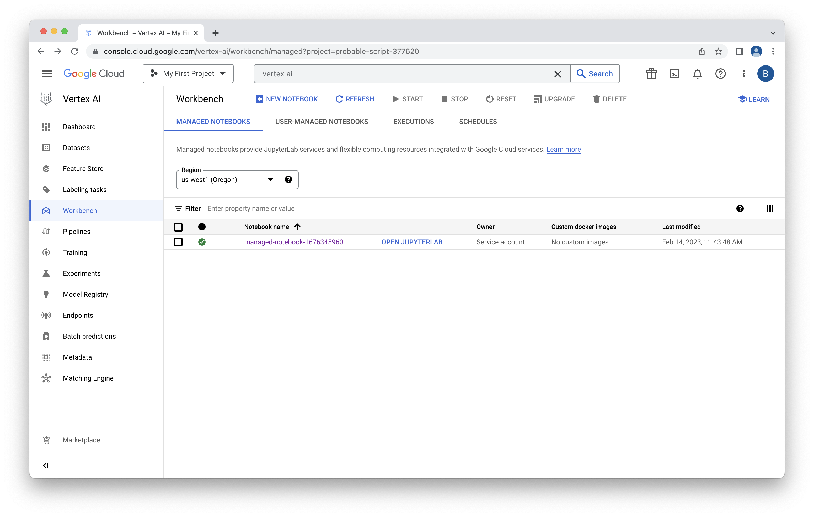

You're now presented with a menu of runtimes available.  We're going to clone the notebooks we need for the remainder of this workshop.  We could do this graphically, but let's use the terminal.  Click on the terminal icon.

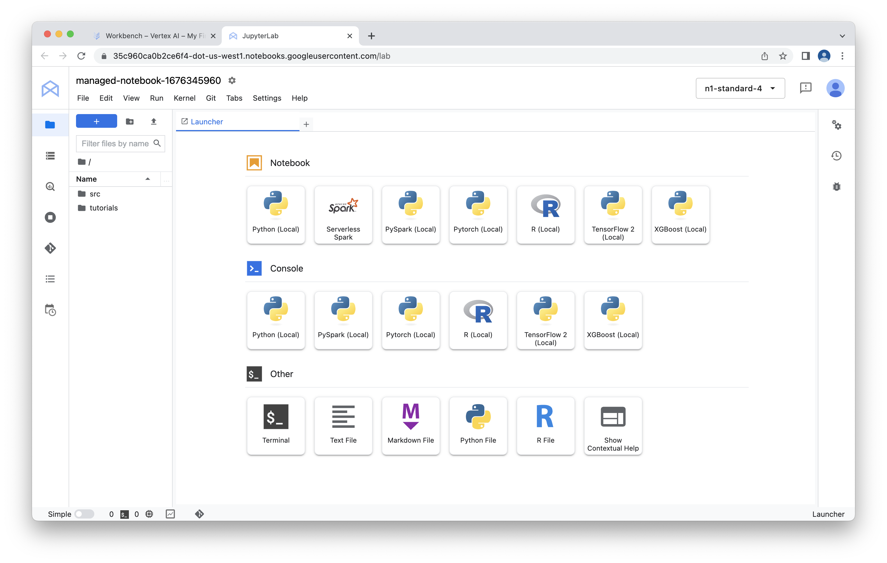

In the terminal type the command:

    git clone https://github.com/neo4j-partners/hands-on-lab-neo4j-and-vertex-ai.git

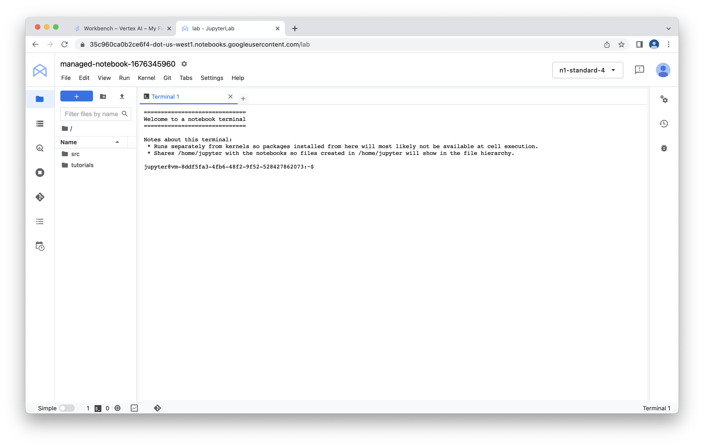

When complete, you should see a message in the terminal as well as a new directory in the file explorer on the left.

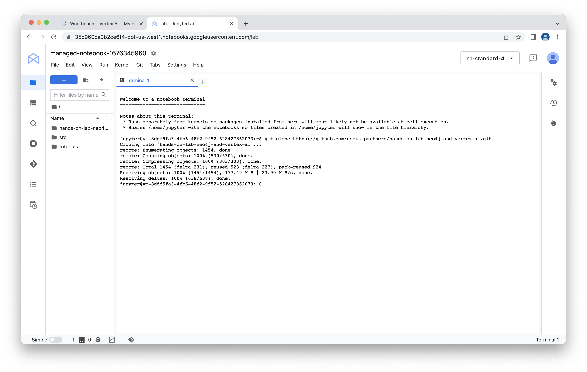

## Cypher Queries
Now that we've got Vertex AI Workbench setup, we're going to run a few queries using the python API.  Earlier we used the graphical interface in the Neo4j Browser.  We're going to do the same thing but in a programmatic way.  

Let's start by firing up a notebook.  Click on the new "hands-on-lab-neo4j-and-vertex-ai" in the file explorer.  Drill down to Lab 5 and open the "exploring_cypher.ipynb" notebook.  Start up a Python kernel and work through that noteboook!

Congratulations on running your notebook in Vertex AI Workbench!